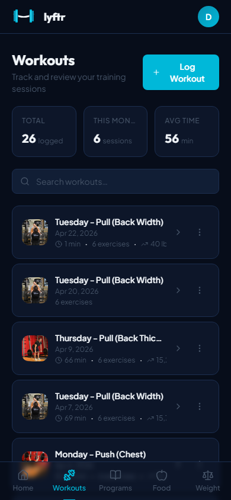

<p align="center">
  <a href="https://github.com/Cawlumm/lyftr/releases/latest"></a>
  <a href="LICENSE"></a>
  
  <a href="https://selfh.st/weekly/2026-04-24/"></a>
  
  <a href="https://discord.gg/hfFWsrebQA"></a>
</p>

<p align="center">
  
</p>

> 🎉 **First beta release is live — [`v0.1.0-beta.1`](https://github.com/Cawlumm/lyftr/releases/tag/v0.1.0-beta.1).** Workouts, programs, gym mode, dashboard, weight, and the new nutrition tracker are all in. Pin this tag for a stable self-host target instead of tracking `main`.

> **Beta** — actively being built. Expect rough edges and frequent updates. Issues and feedback are welcome. The software equivalent of going to the gym for the first time.

> 🌐 **[Live demo → lyftr-demo.fly.dev](https://lyftr-demo.fly.dev)** — log in with `demo@lyftr.local` / `password123`. Shared instance, resets every hour.

---

## Runs on

Tested and working on:

- **Raspberry Pi 4** (2 GB RAM, arm64 Docker image)
- **Any x86 VPS** — Hetzner CAX11, DigitalOcean Droplet, Oracle Free Tier
- **Synology NAS** via Docker (Container Manager)
- **Proxmox LXC** with Docker installed
- **Local machine** — Mac, Linux, Windows (WSL2)

Single SQLite file, minimal RAM, no external services required.

---

## Why Lyftr?

**Hevy and Strong** are polished apps but cloud-only, increasingly paywalled, and your data lives on someone else's server. **Wger** is a solid self-hosted option with a lot of features — Lyftr's focus is a more modern, mobile-first UI and a simpler deployment story. **FitNotes** is local-only with no sync or server deployment story.

Lyftr is for people who want a modern, mobile-first workout tracker that they fully own and can run on a $5 VPS or a Raspberry Pi in the corner. No subscription. No vendor lock-in. No "your export is a Pro feature."

---

## Features

| Feature | Status |
|---------|--------|
| Workout logging with 800+ exercise library | ✓ |
| Program builder — reusable workout templates | ✓ |
| Active workout mode — guided set-by-set flow | ✓ |
| Gym Mode — full-screen card layout, one exercise at a time | ✓ |
| Exercise detail — personal records, progression chart, muscle diagram | ✓ |
| Dashboard — volume trends, consistency heatmap, muscle balance | ✓ |
| Weight tracking with trend graph | ✓ |
| lbs / kg unit support across all data | ✓ |
| Self-hosted — all data stays on your server | ✓ |
| Nutrition tracking — calories, macros, barcode scan, food search | ✓ |
| PWA — installable on any device | Planned |
| Strong / Hevy CSV import | Planned |
| iOS app (Swift) | Planned |

---

## Live Demo

**[lyftr-demo.fly.dev](https://lyftr-demo.fly.dev)**

| Field | Value |
|-------|-------|
| Email | `demo@lyftr.local` |
| Password | `password123` |

Pre-loaded with 8 weeks of PPL workouts, 90 days of weight logs, and food logs so every page has data to explore. Shared instance — resets automatically every hour so any changes are wiped clean.

Or **register your own account** on the demo — your data persists until the next hourly reset, and nobody else can see it.

---

## Quick Start

> No clone. No build. No Go install required. Just Docker.

```bash
curl -o docker-compose.yml https://raw.githubusercontent.com/Cawlumm/lyftr/main/docker-compose.yml
curl -o .env https://raw.githubusercontent.com/Cawlumm/lyftr/main/.env.example
```

Edit `.env` and set a strong `JWT_SECRET` (32+ characters), then:

```bash
docker compose up -d
```

Open `http://localhost` in your browser and create your account. If running on a VPS, replace `localhost` with your server IP or domain.

---

## More Screenshots

<p align="center">
  
  
  
  
  
</p>

<p align="center">
  
</p>

---

## Configuration

All variables live in `.env` at the project root.

| Variable | Default | Description |
|----------|---------|-------------|
| `JWT_SECRET` | *required* | Min 32-char secret for signing tokens |
| `CORS_ORIGIN` | `http://localhost` | Comma-separated allow-list of client origins. Use `*` to allow any (the API is Bearer-token based, no cookies) |
| `PORT` | `80` | Host port for the web interface |
| `BACKEND_ORIGIN` | `backend:3000` | Docker **service name**:port the frontend proxies `/api` to — not a host IP. Only change the port, to match a custom backend `PORT` |

> **Self-hosting note:** `BACKEND_ORIGIN` is resolved over the internal Docker network, so it must use the backend's **service name** (`backend`), not your server's host or LAN IP. The default compose only *exposes* the backend on the Docker network — it isn't published to the host — so pointing `BACKEND_ORIGIN` at something like `192.168.1.10:3000` produces a `502 Bad Gateway` (`connect() failed (111: Connection refused)`). If you set a custom backend `PORT`, change only the port (e.g. `backend:3008`).

---

## Exercise Library

On first startup, Lyftr automatically seeds 800+ exercises from [free-exercise-db](https://github.com/yuhonas/free-exercise-db) in the background. No API key. No setup required. It just works.

```
[startup] exercises table empty — fetching from free-exercise-db...
[startup] seed: synced 868 exercises
```

The seed runs async so the server is immediately available. Exercises appear in the UI within a few seconds.

**Re-sync exercises:** Go to **Settings → Exercise Library** — shows current exercise count and a progress indicator while seeding. Hit **Re-sync** to pull the latest exercises (safe upsert, existing workout data is untouched).

---

## Data & Backups

All workout data is stored in `./data/lyftr.db` (SQLite). Back this up regularly. It's one file. You have no excuse.

```bash
# Backup
cp ./data/lyftr.db ./data/lyftr.db.backup

# Update to latest
docker compose pull && docker compose up -d
```

---

## Running on a VPS

> Because paying $15/month for a fitness app subscription is money better spent on protein powder.

```bash
sudo apt update && sudo apt install -y docker.io docker-compose-plugin

mkdir lyftr && cd lyftr
curl -o docker-compose.yml https://raw.githubusercontent.com/Cawlumm/lyftr/main/docker-compose.yml
curl -o .env https://raw.githubusercontent.com/Cawlumm/lyftr/main/.env.example
nano .env   # set JWT_SECRET and CORS_ORIGIN

docker compose up -d
```

For HTTPS, put Lyftr behind Caddy or nginx with a Let's Encrypt certificate.

---

## Roadmap

- [x] Workout logging + program builder
- [x] Active workout mode (list + gym mode layouts)
- [x] Exercise detail — PRs, progression chart, muscle diagram
- [x] Dashboard with charts and trends
- [x] Weight tracking with trend graph + lbs/kg support
- [x] Docker deployment with E2E test pipeline
- [x] Nutrition tracking — calories, macros, Open Food Facts search, barcode scan, history
- [ ] PWA — installable on any device without an app store
- [ ] Strong / Hevy CSV import — so you don't lose years of data switching
- [ ] Apple Health / Google Fit export
- [ ] iOS app (Swift)
- [ ] Hosted option (no self-hosting required)

---

## Tech Stack

| Layer | Technology |
|-------|-----------|
| Backend | Go, Gin, SQLite |
| Frontend | React, TypeScript, Tailwind CSS, Vite |
| Auth | JWT with refresh tokens |
| Deployment | Docker, nginx |

---

## Development

```bash
# Backend (runs on :3000)
cd backend && go run main.go

# Frontend (runs on :5173, proxies /api to :3000)
cd web && npm install && npm run dev
```

See `backend/config/config.go` for all supported environment variables.

---

## Contributing

Bug reports, feature requests, and pull requests are all welcome. Open an issue before submitting large changes — unlike leg day, communication should not be skipped.

---

## License

[MIT](LICENSE)
